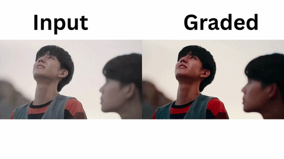

# CINEGRADEAI : AI Video Scene Analyzer & Color Grader

An end-to-end AI pipeline that analyzes video cinematography scene by scene using **Gemini 2.5 Flash**, applies intelligent **color grading** based on the analysis, and exports a before/after comparison video with a PDF report.

Built as a portfolio project targeting Generative AI Engineer roles in creative and media production.



---

## 🧠 How It Works

```
Video input
  → Scene boundary detection       (PySceneDetect)
  → Keyframe extraction            (OpenCV)
  → Cinematography analysis        (Gemini 2.5 Flash Vision)
  → Color grading per scene        (OpenCV + LUT files)
  → PDF report generation          (fpdf2)
  → Graded video export            (FFmpeg / OpenCV VideoWriter)
```

Each scene is analyzed independently. Gemini returns structured JSON with brightness, contrast, saturation, color temperature, and LUT recommendations. These values are applied mathematically to every frame in that scene.

---

## 🛠️ Tech Stack

- **Gemini 2.5 Flash** — multimodal vision analysis (free tier)
- **PySceneDetect** — automatic scene boundary detection
- **OpenCV** — frame extraction, color math, video I/O
- **LUT (.cube files)** — professional cinematic color grades
- **fpdf2** — PDF report generation
- **Gradio** — optional web interface

---

## 📁 Project Structure

```
video_analyzer/
├── main.py                   # pipeline coordinator
├── scene_detector.py         # scene detection + keyframe extraction
├── frame_analyzer.py         # Gemini API calls + JSON parsing
├── color_grader.py           # color grading + LUT application
├── report_generator.py       # PDF report generation
├── app.py                    # Gradio web UI (optional)
├── requirements.txt
└── lut/                      # place your .cube LUT files here
    ├── magic_hour.cube
    ├── dark_somber.cube
    └── ...
```

---

## ⚙️ Setup

**1. Install dependencies**
```bash
pip install -r requirements.txt
```

**2. Get a free Gemini API key**

Go to [aistudio.google.com](https://aistudio.google.com) → Get API key (no credit card required)

**3. Set your API key**
```bash
# macOS / Linux
export GOOGLE_API_KEY="your_key_here"

# Windows
set GOOGLE_API_KEY=your_key_here
```

**4. Add your LUT files**

Place your `.cube` LUT files inside the `lut/` folder. The project expects these 13 files:

```
dark_somber.cube        hard_boost.cube         long_beach_morning.cube
lush_green.cube         magic_hour.cube         natural_boost.cube
orange_and_blue.cube    soft_bw.cube            waves.cube
blue_architecture.cube  blue_hour.cube          cold_chrome.cube
crisp_autumn.cube
```

Free `.cube` LUT packs are widely available — search "free cinematic LUT pack .cube download".

---

## 🚀 Usage

### Option 1 — Terminal (no UI needed)

```bash
python main.py your_video.mp4
```

Output files are saved to `output/`:

```
output/
├── graded_video.mp4          ←  color graded result
├── analysis_report.pdf       ←  scene-by-scene PDF report
├── analysis_data.json        ←  raw Gemini analysis for every scene
└── keyframes/                ←  extracted keyframe images
```

### Option 2 — Gradio Web Interface

```bash
python app.py
```

Open `http://localhost:7860` in your browser. Upload a video, click **Analyze & Grade Video**, and see the original and graded video side by side with the full analysis.

---

## 🎛️ Tuning Settings for Different Videos

There is no single setting that works perfectly for every video. Different content requires different tuning. Here is what to adjust and when.

### Scene Detection Threshold — `scene_detector.py`

```python
ContentDetector(threshold=27)   # line 24 in scene_detector.py
```

| Video Type | Recommended Threshold |
|---|---|
| Personal raw footage, mixed scenes | `25 – 30` |
| Nature documentary, slow cuts | `20 – 25` |
| Music video, fast cuts | `30 – 35` |
| CGI / animation / movie (Avatar etc.) | `40 – 50` |

**Lower threshold** = more sensitive = detects more (possibly false) cuts  
**Higher threshold** = less sensitive = only detects hard, obvious cuts

If you are getting too many scenes detected on a single continuous shot, raise the threshold. If cuts are being missed, lower it.

### LUT Blend Strength — `color_grader.py`

```python
apply_lut2frame(graded, lut_array, strength=0.6)   # line ~136 in color_grader.py
```

| Video Type | Recommended Strength |
|---|---|
| Personal raw / flat footage | `0.6 – 0.7` |
| Mixed personal clips | `0.5 – 0.6` |
| Already color graded footage (films, music videos) | `0.3 – 0.4` |
| CGI / animation | `0.25 – 0.35` |

**Why this matters:** Films like Avatar are professionally color graded before you receive them. Applying a full-strength LUT on top of existing grading stacks two grades together and produces heavy color casts (usually blue or teal). Reducing strength to `0.3–0.4` blends the LUT subtly without overriding the original grade.

### Color Temperature Multipliers — `color_grader.py`

```python
result[:, :, 2] *= 1.08   # Red channel (warm)
result[:, :, 0] *= 0.92   # Blue channel (warm)
```

| Video Type | Recommended Multiplier |
|---|---|
| Personal raw footage | `1.08 / 0.92` (current default) |
| Movie / pre-graded footage | `1.04 / 0.96` (subtle) |
| Animation / CGI | `1.03 / 0.97` (very subtle) |

### Quick Reference — Settings by Video Type

| Video Type | Threshold | LUT Strength | Temp Multiplier |
|---|---|---|---|
| Personal raw clip | `27` | `0.65` | `1.08 / 0.92` |
| Nature documentary | `25` | `0.65` | `1.08 / 0.92` |
| Music video | `30` | `0.50` | `1.06 / 0.94` |
| Pre-graded film clip | `45` | `0.35` | `1.04 / 0.96` |
| CGI / animation | `50` | `0.30` | `1.03 / 0.97` |

> **Best results:** Use your own raw or lightly processed footage. The pipeline is designed for flat/raw video that benefits from AI-driven grading. Pre-graded Hollywood films are already professionally color corrected and will show aggressive or unnatural results at default settings.

---

## ⚠️ Known Limitations

### Speed

Processing is CPU-bound. Every single frame of the video passes through multiple OpenCV operations (brightness/contrast, saturation conversion, color temperature, LUT lookup). A 2-minute video at 30fps = 3,600 frames processed individually.

**Approximate processing times on a mid-range CPU:**

| Video Length | Scenes | Approx. Time |
|---|---|---|
| 30 seconds | 5 – 8 | 2 – 4 min |
| 2 minutes | 15 – 25 | 8 – 15 min |
| 5 minutes | 30 – 50 | 20 – 35 min |

This is a known limitation of CPU-based per-frame processing. A GPU-accelerated pipeline (CUDA OpenCV) would be significantly faster but requires additional setup. For portfolio demonstration purposes, short clips of 30–60 seconds are recommended.

### Gemini Free Tier Quota

Gemini 2.5 Flash free tier allows approximately **25 requests per day (RPD)**. Each scene = 1 API request. A video with 25 scenes will exhaust the daily quota in a single run. The quota resets every 24 hours.

**Workaround:** Use shorter videos (under 60 seconds) with fewer scenes for demos, or use a video with slow cuts so fewer scenes are detected.

### Temporal Consistency

Gemini analyzes each keyframe **independently** with no memory of surrounding scenes. It does not know what the previous or next scene looked like. This means:

- Two visually similar scenes may receive different grading suggestions
- Scene-to-scene grading transitions can feel inconsistent on long videos
- Videos shot in a single location with consistent lighting will show the most noticeable inconsistency

A 15-frame transition blend is applied at scene boundaries to smooth hard jumps, but underlying suggestion inconsistency from the model cannot be fully corrected at the grading stage.

### Pre-Graded Film Footage

The pipeline is designed for **raw or lightly processed footage**. Professionally color graded films (theatrical releases, music videos, CGI animations) already have a deliberate color grade applied. Running this pipeline on pre-graded footage stacks a second grade on top, often producing heavy color casts. Reduce LUT strength to `0.3` and temperature multipliers to `1.03/0.97` for such content.

### Single-Shot Videos

PySceneDetect requires at least one detectable cut in the video. If the video is a single uncut shot with no camera cuts, the pipeline will detect zero scenes and exit early. Minimum recommended: 2 or more distinct shots.

### Audio

The graded output video has no audio. The pipeline uses OpenCV VideoWriter which does not carry audio tracks. If audio is needed, re-add it manually using FFmpeg after grading:

```bash
ffmpeg -i output/graded_video.mp4 -i your_original_video.mp4 -c copy -map 0:v:0 -map 1:a:0 output/graded_with_audio.mp4
```

---

## 📊 Example Output

**JSON analysis per scene (`analysis_data.json`):**
```json
{
  "scene_number": 3,
  "mood": "warm",
  "scene_description": "Golden hour exterior shot of a street with long shadows",
  "director_note": "Boost warmth to enhance the golden feel of the shot",
  "issues": ["slightly underexposed", "low contrast"],
  "adjustments": {
    "brightness": 20,
    "contrast": 15,
    "saturation": 1.3,
    "color_temp": "warm",
    "lut": "magic_hour"
  }
}
```

---

## 📄 License

MIT License — free to use, modify, and distribute.
